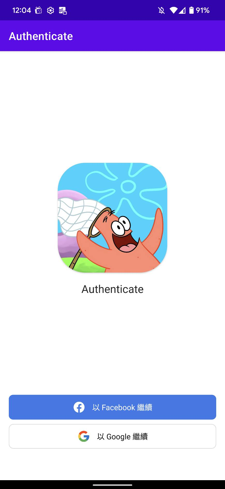
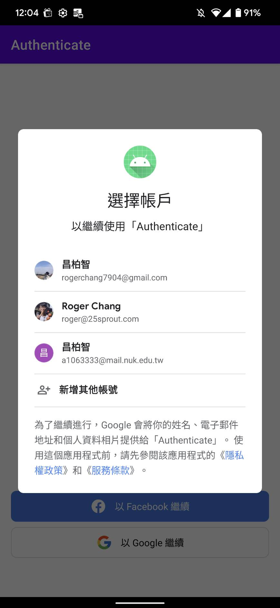
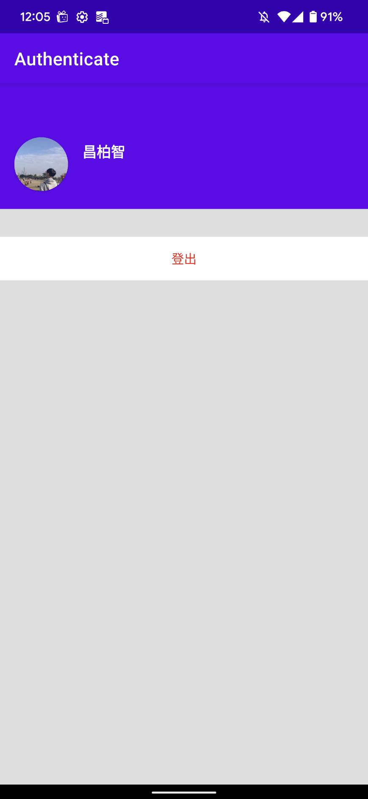

# 
Authenticate with Google or Facebook on Android

有興趣了解詳細內容可以觀看 <a href="https://medium.com/@rogerchang7904/authenticate-with-google-or-facebook-on-android-14a24f9291fe">Medium 教學文章</a>
  

 

  
  
  

***
